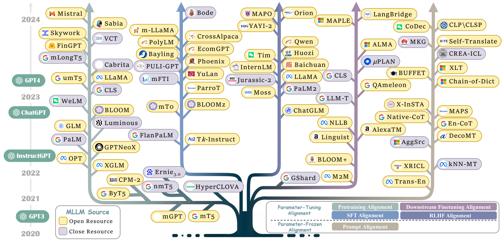
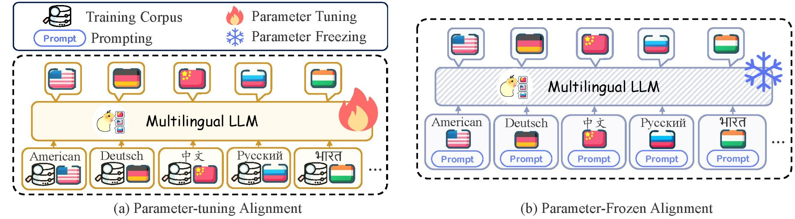

# Awesome-Multilingual-LLM


🔥 **The paperlist & Data Resources website is also available on \[[ArXiv](https://arxiv.org/abs/2404.04925)\].**

🌟 **Any contributions via PRs, issues, emails or other methods are greatly appreciated.**

🔮 **Interactive paperlist&benchmark website is also available on [multilingual-llm.net](https://multilingual-llm.net/)**

## Introduction



In recent years, remarkable progress has been witnessed in large language models (LLMS) , which have achieved excellent performance on various natural language processing tasks. In addition, LLMs raise surprising emergent capabilities, including in-context learning, chain-of-thought reasoning and even planning. Nevertheless, the majority of LLMs are English-Centric LLMs that mainly focus on the English tasks, which still slightly weak for multilingual setting, especially in low-resource scenarios.

Actually, there are over 7000 languages in the world. With the acceleration of globalization, the success of large language models should consider to serve diverse countries and languages. To this end, multilingual large language models (MLLM) possess the advantage when handling multiple languages, gaining increasing attention.

The existing MLLMs can be divided into three groups based on different stages. The first series of work leverage large amounts of multilingual data in the pre-training state to boost the overall multilingual performance. The second series of work focus on incorporating multilingual data during supervised fine-tuning (SFT) stage. The third series of work also adapt the advanced prompting strategies to unlock deeper multilingual potential of MLLM during parameter-frozen inference.



While promising performance have been witnessed in the MLLM, there still remains a lack of a comprehensive review and analysis of recent efforts in the literature, which hinder the development of MLLMs. To bridge this gap, we make the first attempt to conduct a comprehensive and detailed analysis for MLLMs. Specifically, we first introduce the widely used data resource, and in order to provide a unified perspective for understanding MLLM efforts in the literature , we introduce a novel taxonomy focusing on alignment strategies including **Parameter-Tuning Alignment** and **Parameter-Frozen Alignment**.

## Paperlist

### 1. Parameter-Tuned Alignment

#### 1.1 SFT Alignment

- [2024] **Introducing Bode: A Fine-Tuned Large Language Model for Portuguese Prompt-Based Task.** *Garcia et al.* `Arxiv` [[paper](https://arxiv.org/abs/2401.02909)] 
- [2024] **Question Translation Training for Better Multilingual Reasoning.** *Zhu et al.* `Arxiv` [[paper](https://arxiv.org/abs/2401.07817)] [[code](https://github.com/NJUNLP/Qalign)]
- [2024] **xCoT: Cross-lingual Instruction Tuning for Cross-lingual Chain-of-Thought Reasoning.** *Chai et al.* `Arxiv` [[paper](https://arxiv.org/abs/2401.07037)] 
- [2024] **Towards Boosting Many-to-Many Multilingual Machine Translation with Large Language Models.** *Gao et al.* `Arxiv` [[paper](https://arxiv.org/abs/2401.05861)] [[code](https://github.com/gpengzhi/CrossConST-LLM)]
- [2023] **ParroT: Translating during chat using large language models tuned with human translation and feedback.** *Jiao et al.* `Arxiv` [[paper](https://arxiv.org/abs/2304.02426)] [[code](https://github.com/wxjiao/ParroT)]
- [2023] **Phoenix: Democratizing chatgpt across languages.** *Chen et al.* `Arxiv` [[paper](https://arxiv.org/abs/2304.10453)] [[code](https://github.com/FreedomIntelligence/LLMZoo)]
- [2023] **Improving Translation Faithfulness of Large Language Models via Augmenting Instructions.** *Chen et al.* `Arxiv` [[paper](https://arxiv.org/abs/2308.12674)] [[code](https://github.com/pppa2019/swie_overmiss_llm4mt)]
- [2023] **Empowering Multi-step Reasoning across Languages via Tree-of-Thoughts.** *Ranaldi et al.* `Arxiv` [[paper](https://arxiv.org/abs/2311.08097)] 
- [2023] **EcomGPT: Instruction-tuning Large Language Model with Chain-of-Task Tasks for E-commerce.** *Li et al.* `Arxiv` [[paper](https://arxiv.org/abs/2308.06966)] [[code](https://github.com/Alibaba-NLP/EcomGPT)]
- [2023] **Improving Translation Faithfulness of Large Language Models via Augmenting Instructions.** *Chen et al.* `Arxiv` [[paper](https://arxiv.org/abs/2308.12674)] [[code](https://github.com/pppa2019/swie_overmiss_llm4mt)]
- [2023] **Camoscio: An italian instruction-tuned llama.** *Santilli et al.* `Arxiv` [[paper](https://arxiv.org/abs/2307.16456)] 
- [2023] **Conversations in Galician: a Large Language Model for an Underrepresented Language.** *Bao et al.* `Arxiv` [[paper](https://arxiv.org/abs/2311.03812)] [[code](https://gitlab.irlab.org/irlab/cabuxa)]
- [2023] **Building a Llama2-finetuned LLM for Odia Language Utilizing Domain Knowledge Instruction Set.** *Kohli et al.* `Arxiv` [[paper](https://arxiv.org/abs/2312.12624)] 
- [2023] **Making Instruction Finetuning Accessible to Non-English Languages: A Case Study on Swedish Models.** *Holmstrom et al.* `NoDaLiDa` [[paper](https://aclanthology.org/2023.nodalida-1.62)] [[code](https://github.com/oskarholmstrom/sweinstruct)]
- [2023] **Extrapolating Large Language Models to Non-English by Aligning Languages.** *Zhu et al.* `Arxiv` [[paper](https://arxiv.org/abs/2308.04948)] [[code](https://github.com/NJUNLP/x-LLM)]
- [2023] **Instruct-Align: Teaching Novel Languages with to LLMs through Alignment-based Cross-Lingual Instruction.** *Cahyawijaya et al.* `Arxiv` [[paper](https://arxiv.org/abs/2305.13627)] [[code](https://github.com/HLTCHKUST/InstructAlign)]
- [2023] **Eliciting the Translation Ability of Large Language Models via Multilingual Finetuning with Translation Instructions.** *Li et al.* `Arxiv` [[paper](https://arxiv.org/abs/2305.15083)] 
- [2023] **Palm 2 technical report.** *Anil et al.* `Arxiv` [[paper](https://arxiv.org/abs/2305.10403)] 
- [2023] **TaCo: Enhancing Cross-Lingual Transfer for Low-Resource Languages in LLMs through Translation-Assisted Chain-of-Thought Processes.** *Upadhayay et al.* `Arxiv` [[paper](https://arxiv.org/abs/2311.10797)] [[code](https://github.com/UNHSAILLab/TaCo)]
- [2023] **Polylm: An open source polyglot large language model.** *Wei et al.* `Arxiv` [[paper](https://arxiv.org/abs/2307.06018)] [[code](https://modelscope.cn/models/damo/nlp_polylm_13b_text_generation/)]
- [2023] **Mono- and multilingual GPT-3 models for Hungarian.** *Yang et al.* `LNAI` [[paper](https://link.springer.com/chapter/10.1007/978-3-031-40498-6_9)] 
- [2023] **BayLing: Bridging Cross-lingual Alignment and Instruction Following through Interactive Translation for Large Language Models.** *Zhang et al.* `Arxiv` [[paper](https://arxiv.org/abs/2306.10968)] [[code](https://github.com/ictnlp/BayLing)]
- [2023] **Efficient and effective text encoding for chinese llama and alpaca.** *Cui et al.* `Arxiv` [[paper](https://arxiv.org/abs/2304.08177)] 
- [2023] **Monolingual or Multilingual Instruction Tuning: Which Makes a Better Alpaca.** *Chen et al.* `Arxiv` [[paper](https://arxiv.org/abs/2309.08958)] [[code](https://github.com/hplt-project/monolingual-multilingual-instruction-tuning)]
- [2023] **YuLan-Chat: An Open-Source Bilingual Chatbot.** *YuLan-Teaml.* [[code](https://github.com/RUC-GSAI/YuLan-Chat)]
- [2022] **Crosslingual generalization through multitask finetuning.** *Muennighoff et al.* `Arxiv` [[paper](https://arxiv.org/abs/2211.01786)] 
- [2022] **Super-naturalinstructions: Generalization via declarative instructions on 1600+ nlp tasks.** *Wang et al.* `ACL` [[paper](https://aclanthology.org/2022.emnlp-main.340)] 
- [2022] **Scaling instruction-finetuned language models.** *Chung et al.* `Arxiv` [[paper](https://arxiv.org/abs/2210.11416)] 

#### 1.2 Pretraining Alignment

- [2024] **Mixtral of experts.** *Jiang et al.* `Arxiv` [[paper](https://arxiv.org/abs/2401.04088)] [[code](https://github.com/mistralai/mistral-src)]
- [2024] **TURNA: A Turkish Encoder-Decoder Language Model for Enhanced Understanding and Generation.** *Uludogan et al.* `Arxiv` [[paper](https://arxiv.org/abs/2401.14373)] [[code](https://huggingface.co/boun-tabi-LMG/TURNA)]
- [2024] **Breaking the Curse of Multilinguality with Cross-lingual Expert Language Models.** *Blevins et al.* `Arxiv` [[paper](https://arxiv.org/abs/2401.10440)] 
- [2024] **Chinese-Mixtral-8x7B: An Open-Source Mixture-of-Experts LLM.** *HIT-SCIR.* [[code](https://github.com/HIT-SCIR/Chinese-Mixtral-8x7B)]
- [2023] **FinGPT: Large Generative Models for a Small Language.** *Luukkonen et al.* `Arxiv` [[paper](https://arxiv.org/abs/2311.05640)] [[code](https://turkunlp.org/gpt3-finnish)]
- [2023] **Llama 2: Open foundation and fine-tuned chat models.** *Touvron et al.* `Arxiv` [[paper](https://arxiv.org/abs/2307.09288)] [[code](https://github.com/facebookresearch/llama)]
- [2023] **Mistral 7B.** *Jiang et al.* `Arxiv` [[paper](https://arxiv.org/abs/2310.06825)] [[code](https://github.com/mistralai/mistral-src)]
- [2023] **Bridging the Resource Gap: Exploring the Efficacy of English and Multilingual LLMs for Swedish.** *Holmstrom et al.* `ACL` [[paper](https://aclanthology.org/2023.resourceful-1.13)] 
- [2023] **JASMINE: Arabic GPT Models for Few-Shot Learning.** *Abdul-Mageed et al.* `Arxiv` [[paper](https://arxiv.org/abs/2212.10755)] 
- [2023] **Cross-Lingual Supervision improves Large Language Models Pre-training.** *Schioppa et al.* `Arxiv` [[paper](https://arxiv.org/abs/2305.11778)] 
- [2023] **Searching for Needles in a Haystack: On the Role of Incidental Bilingualism in PaLM's Translation Capability.** *Briakou et al.* `Arxiv` [[paper](https://arxiv.org/abs/2305.10266)] 
- [2023] **Cross-Lingual Transfer of Large Language Model by Visually-Derived Supervision Toward Low-Resource Languages.** *Muraoka et al.* `ACM MM` [[paper](https://dl.acm.org/doi/abs/10.1145/3581783.3611992)] 
- [2023] **Skywork: A more open bilingual foundation model.** *Wei et al.* `Arxiv` [[paper](https://arxiv.org/abs/2310.19341)] [[code](https://github.com/SkyworkAI/Skywork)]
- [2023] **Multi-Lingual Sentence Alignment with GPT Models.** *Liang et al.* `AiDAS` [[paper](https://ieeexplore.ieee.org/abstract/document/10284652)] 
- [2023] **Llama: Open and efficient foundation language models.** *Touvron et al.* `Arxiv` [[paper](https://arxiv.org/abs/2302.13971)] [[code](https://github.com/facebookresearch/llama)]
- [2023] **LLaMAntino: LLaMA 2 Models for Effective Text Generation in Italian Language.** *Basile et al.* `Arxiv` [[paper](https://arxiv.org/abs/2312.09993)] 
- [2023] **mLongT5: A Multilingual and Efficient Text-To-Text Transformer for Longer Sequences.** *Uthus et al.* `Arxiv` [[paper](https://arxiv.org/abs/2305.11129)] [[code](https://github.com/google-research/longt5)]
- [2023] **Cabrita: closing the gap for foreign languages.** *Larcher et al.* `Arxiv` [[paper](https://arxiv.org/abs/2308.11878)] 
- [2023] **Align after Pre-train: Improving Multilingual Generative Models with Cross-lingual Alignment.** *Li et al.* `Arxiv` [[paper](https://arxiv.org/abs/2311.08089)] 
- [2023] **Sabi��: Portuguese Large Language Models.** *Pires et al.* `Arxiv` [[paper](https://arxiv.org/abs/2304.07880)] [[code](https://huggingface.co/maritaca-ai/sabia-7b)]
- [2023] **Efficient and effective text encoding for chinese llama and alpaca.** *Cui et al.* `Arxiv` [[paper](https://arxiv.org/abs/2304.08177)] [[code](https://github.com/ymcui/Chinese-LLaMA-Alpaca)]
- [2022] **Language contamination helps explain the cross-lingual capabilities of English pretrained models.** *Blevins et al.* `Arxiv` [[paper](https://arxiv.org/abs/2204.08110)] 
- [2022] **Byt5: Towards a token-free future with pre-trained byte-to-byte models.** *Xue et al.* `TACL` [[paper](https://arxiv.org/abs/2105.13626)] [[code](https://github.com/google-research/byt5)]
- [2022] **Overcoming catastrophic forgetting in zero-shot cross-lingual generation.** *Vu et al.* `EMNLP` [[paper](https://aclanthology.org/2022.emnlp-main.630)] 
- [2022] **UniMax: Fairer and More Effective Language Sampling for Large-Scale Multilingual Pretraining.** *Chung et al.* `Arxiv` [[paper](https://arxiv.org/abs/2304.09151)] 
- [2022] **mgpt: Few-shot learners go multilingual.** *Shliazhko et al.* `Arxiv` [[paper](https://arxiv.org/abs/2204.07580)] [[code](https://github.com/ai-forever/mgpt)]
- [2022] **Few-shot Learning with Multilingual Generative Language Models.** *Lin et al.* `EMNLP` [[paper](https://aclanthology.org/2022.emnlp-main.616)] [[code](https://github.com/facebookresearch/fairseq/tree/main/examples/xglm)]
- [2022] **Glm-130b: An open bilingual pre-trained model.** *Zeng et al.* `Arxiv` [[paper](https://arxiv.org/abs/2210.02414)] [[code](https://github.com/THUDM/GLM-130B/)]
- [2022] **Palm: Scaling language modeling with pathways.** *Chowdhery et al.* `Arxiv` [[paper](https://arxiv.org/abs/2204.02311)] 
- [2022] **GPT-NeoX-20B: An Open-Source Autoregressive Language Model.** *Black et al.* `ACL` [[paper](https://aclanthology.org/2022.bigscience-1.9)] [[code](https://github.com/EleutherAI/gpt-neox)]
- [2022] **Opt: Open pre-trained transformer language models.** *Zhang et al.* `Arxiv` [[paper](https://arxiv.org/abs/2205.01068)] 
- [2022] **Bloom: A 176b-parameter open-access multilingual language model.** *Workshop et al.* `Arxiv` [[paper](https://arxiv.org/abs/2211.05100)] [[code](https://huggingface.co/bigscience/bloom)]
- [2022] **Welm: A well-read pre-trained language model for chinese.** *Su et al.* `Arxiv` [[paper](https://arxiv.org/abs/2209.10372)] 
- [2021] **Cpm-2: Large-scale cost-effective pre-trained language models.** *Zhang et al.* `Arxiv` [[paper](https://arxiv.org/abs/2106.10715)] [[code](https://github.com/TsinghuaAI/CPM)]
- [2021] **nmT5--Is parallel data still relevant for pre-training massively multilingual language models?.** *Kale et al.* `ACL` [[paper](https://aclanthology.org/2021.acl-short.87)] 
- [2021] **What Changes Can Large-scale Language Models Bring? Intensive Study on HyperCLOVA: Billions-scale Korean Generative Pretrained Transformers.** *Kim et al.* `EMNLP` [[paper](https://aclanthology.org/2021.emnlp-main.274)] 
- [2021] **Ernie 3.0: Large-scale knowledge enhanced pre-training for language understanding and generation.** *Sun et al.* `Arxiv` [[paper](https://arxiv.org/abs/2107.02137)] 
- [2020] **mT5: A massively multilingual pre-trained text-to-text transformer.** *Xue et al.* `ACL` [[paper](https://aclanthology.org/2021.naacl-main.41)] [[code](https://github.com/google-research/multilingual-t5)]
- [2020] **Language models are few-shot learners.** *Brown et al.* `Arxiv` [[paper](https://arxiv.org/abs/2209.14500)] 

#### 1.3 RLHF Alignment

- [2024] **Huozi: An Open-Source Universal LLM.** *Huozi Team.* [[code](https://github.com/HIT-SCIR/huozi)]
- [2024] **MAPO: Advancing Multilingual Reasoning through Multilingual Alignment-as-Preference Optimization.** *She et al.* `Arxiv` [[paper](https://arxiv.org/abs/2401.06838)] 
- [2024] **Orion-14B: Open-source Multilingual Large Language Models.** *Chen et al.* `Arxiv` [[paper](https://arxiv.org/abs/2401.12246)] [[code](https://github.com/OrionStarAI/Orion)]
- [2023] **TigerBot: An Open Multilingual Multitask LLM.** *Chen et al.* `Arxiv` [[paper](https://arxiv.org/abs/2312.08688)] [[code](https://github.com/TigerResearch/TigerBot)]
- [2023] **Aligning Neural Machine Translation Models: Human Feedback in Training and Inference.** *Moura Ramos et al.* `Arxiv` [[paper](https://arxiv.org/abs/2311.09132)] 
- [2023] **Salmon: Self-alignment with principle-following reward models.** *Sun et al.* `Arxiv` [[paper](https://arxiv.org/abs/2310.05910)] [[code](https://github.com/IBM/SALMON)]
- [2023] **SteerLM: Attribute Conditioned SFT as an (User-Steerable) Alternative to RLHF.** *Dong et al.* `Arxiv` [[paper](https://arxiv.org/abs/2310.05344)] [[code](https://huggingface.co/nvidia/SteerLM-llama2-13B)]
- [2023] **Direct Preference Optimization for Neural Machine Translation with Minimum Bayes Risk Decoding.** *Yang et al.* `Arxiv` [[paper](https://arxiv.org/abs/2311.08380)] 
- [2023] **YAYI 2: Multilingual Open-Source Large Language Models.** *Luo et al.* `Arxiv` [[paper](https://arxiv.org/abs/2312.14862)] 
- [2023] **Tim: Teaching large language models to translate with comparison.** *Zeng et al.* `Arxiv` [[paper](https://arxiv.org/abs/2307.04408)] [[code](https://github.com/lemon0830/TIM)]
- [2023] **Internlm: A multilingual language model with progressively enhanced capabilities.** *Team et al.* [[paper](https://raw.githubusercontent.com/InternLM/InternLM-techreport/main/InternLM.pdf)] [[code](https://github.com/InternLM/InternLM)]
- [2023] **Baichuan 2: Open large-scale language models.** *Yang et al.* `Arxiv` [[paper](https://arxiv.org/abs/2309.10305)] [[code](https://github.com/baichuan-inc/Baichuan2)]
- [2023] **MOSS: Training Conversational Language Models from Synthetic Data.** *Sun et al.* [[code](https://github.com/OpenLMLab/MOSS)]
- [2023] **Llama 2: Open foundation and fine-tuned chat models.** *Touvron et al.* `Arxiv` [[paper](https://arxiv.org/abs/2307.09288)] [[code](https://github.com/facebookresearch/llama)]
- [2023] **Qwen-vl: A frontier large vision-language model with versatile abilities.** *Bai et al.* `Arxiv` [[paper](https://arxiv.org/abs/2308.12966)] [[code](https://github.com/QwenLM/Qwen-VL)]
- [2023] **Okapi: Instruction-tuned Large Language Models in Multiple Languages with Reinforcement Learning from Human Feedback.** *Lai et al.* `Arxiv` [[paper](https://arxiv.org/abs/2307.16039)] [[code](https://github.com/nlp-uoregon/Okapi)]
- [2023] **GPT-4 Technical Report.** *OpenAI.* `Arxiv` [[paper](https://arxiv.org/abs/2303.08774)] 
- [2022] **Glm-130b: An open bilingual pre-trained model.** *Zeng et al.* `Arxiv` [[paper](https://arxiv.org/abs/2210.02414)] [[code](https://github.com/THUDM/GLM-130B/)]
- [2022] **ChatGPT.** *OpenAI.* `Arxiv` [[paper](https://arxiv.org/abs/2401.17163)] 

#### 1.4 Finetuning Alignment

- [2024] **Towards Boosting Many-to-Many Multilingual Machine Translation with Large Language Models.** *Gao et al.* `Arxiv` [[paper](https://arxiv.org/abs/2401.05861)] [[code](https://github.com/gpengzhi/CrossConST-LLM)]
- [2024] **MAPO: Advancing Multilingual Reasoning through Multilingual Alignment-as-Preference Optimization.** *She et al.* `Arxiv` [[paper](https://arxiv.org/abs/2401.06838)] 
- [2024] **Introducing Bode: A Fine-Tuned Large Language Model for Portuguese Prompt-Based Task.** *Garcia et al.* `Arxiv` [[paper](https://arxiv.org/abs/2401.02909)] 
- [2024] **Question Translation Training for Better Multilingual Reasoning.** *Zhu et al.* `Arxiv` [[paper](https://arxiv.org/abs/2401.07817)] [[code](https://github.com/NJUNLP/Qalign)]
- [2024] **xCoT: Cross-lingual Instruction Tuning for Cross-lingual Chain-of-Thought Reasoning.** *Chai et al.* `Arxiv` [[paper](https://arxiv.org/abs/2401.07037)] 
- [2024] **Orion-14B: Open-source Multilingual Large Language Models.** *Chen et al.* `Arxiv` [[paper](https://arxiv.org/abs/2401.12246)] [[code](https://github.com/OrionStarAI/Orion)]
- [2023] **TaCo: Enhancing Cross-Lingual Transfer for Low-Resource Languages in LLMs through Translation-Assisted Chain-of-Thought Processes.** *Upadhayay et al.* `Arxiv` [[paper](https://arxiv.org/abs/2311.10797)] [[code](https://github.com/UNHSAILLab/TaCo)]
- [2023] **TigerBot: An Open Multilingual Multitask LLM.** *Chen et al.* `Arxiv` [[paper](https://arxiv.org/abs/2312.08688)] [[code](https://github.com/TigerResearch/TigerBot)]
- [2023] **YAYI 2: Multilingual Open-Source Large Language Models.** *Luo et al.* `Arxiv` [[paper](https://arxiv.org/abs/2312.14862)] [[code](https://github.com/wenge-research/YAYI2)]
- [2023] **Tim: Teaching large language models to translate with comparison.** *Zeng et al.* `Arxiv` [[paper](https://arxiv.org/abs/2307.04408)] [[code](https://github.com/lemon0830/TIM)]
- [2023] **Direct Preference Optimization for Neural Machine Translation with Minimum Bayes Risk Decoding.** *Yang et al.* `Arxiv` [[paper](https://arxiv.org/abs/2311.08380)] 
- [2023] **Camoscio: An italian instruction-tuned llama.** *Santilli et al.* `Arxiv` [[paper](https://arxiv.org/abs/2307.16456)] [[code](https://github.com/teelinsan/camoscio)]
- [2023] **Improving Translation Faithfulness of Large Language Models via Augmenting Instructions.** *Chen et al.* `Arxiv` [[paper](https://arxiv.org/abs/2308.12674)] [[code](https://github.com/pppa2019/swie_overmiss_llm4mt)]
- [2023] **Qwen-vl: A frontier large vision-language model with versatile abilities.** *Bai et al.* `Arxiv` [[paper](https://arxiv.org/abs/2308.12966)] [[code](https://github.com/QwenLM/Qwen-VL)]
- [2023] **EcomGPT: Instruction-tuning Large Language Model with Chain-of-Task Tasks for E-commerce.** *Li et al.* `Arxiv` [[paper](https://arxiv.org/abs/2308.06966)] [[code](https://github.com/Alibaba-NLP/EcomGPT)]
- [2023] **SteerLM: Attribute Conditioned SFT as an (User-Steerable) Alternative to RLHF.** *Dong et al.* `Arxiv` [[paper](https://arxiv.org/abs/2310.05344)] [[code](https://huggingface.co/nvidia/SteerLM-llama2-13B)]
- [2023] **Empowering Multi-step Reasoning across Languages via Tree-of-Thoughts.** *Ranaldi et al.* `Arxiv` [[paper](https://arxiv.org/abs/2311.08097)] 
- [2023] **Salmon: Self-alignment with principle-following reward models.** *Sun et al.* `Arxiv` [[paper](https://arxiv.org/abs/2310.05910)] [[code](https://github.com/IBM/SALMON)]
- [2023] **Aligning Neural Machine Translation Models: Human Feedback in Training and Inference.** *Moura Ramos et al.* `Arxiv` [[paper](https://arxiv.org/abs/2311.09132)] 
- [2023] **Improving Translation Faithfulness of Large Language Models via Augmenting Instructions.** *Chen et al.* `Arxiv` [[paper](https://arxiv.org/abs/2308.12674)] [[code](https://github.com/pppa2019/swie_overmiss_llm4mt)]
- [2023] **Internlm: A multilingual language model with progressively enhanced capabilities.** *Team et al.* [[paper](https://raw.githubusercontent.com/InternLM/InternLM-techreport/main/InternLM.pdf)] [[code](https://github.com/InternLM/InternLM)]
- [2023] **Huozi: An Open-Source Universal LLM.** *Huozi Team.* [[code](https://github.com/HIT-SCIR/huozi)]
- [2023] **ParroT: Translating during chat using large language models tuned with human translation and feedback.** *Jiao et al.* `Arxiv` [[paper](https://arxiv.org/abs/2304.02426)] [[code](https://github.com/wxjiao/ParroT)]
- [2023] **Baichuan 2: Open large-scale language models.** *Yang et al.* `Arxiv` [[paper](https://arxiv.org/abs/2309.10305)] [[code](https://github.com/baichuan-inc/Baichuan2)]
- [2023] **Conversations in Galician: a Large Language Model for an Underrepresented Language.** *Bao et al.* `Arxiv` [[paper](https://arxiv.org/abs/2311.03812)] [[code](https://huggingface.co/irlab-udc/cabuxa-7b)]
- [2023] **MOSS: Training Conversational Language Models from Synthetic Data.** *Sun et al.* 
- [2023] **Llama 2: Open foundation and fine-tuned chat models.** *Touvron et al.* `Arxiv` [[paper](https://arxiv.org/abs/2307.09288)] [[code](https://github.com/facebookresearch/llama)]
- [2023] **Okapi: Instruction-tuned Large Language Models in Multiple Languages with Reinforcement Learning from Human Feedback.** *Lai et al.* `Arxiv` [[paper](https://arxiv.org/abs/2307.16039)] [[code](https://github.com/nlp-uoregon/Okapi)]
- [2023] **Building a Llama2-finetuned LLM for Odia Language Utilizing Domain Knowledge Instruction Set.** *Kohli et al.* `Arxiv` [[paper](https://arxiv.org/abs/2312.12624)] 
- [2023] **Making Instruction Finetuning Accessible to Non-English Languages: A Case Study on Swedish Models.** *Holmstrom et al.* `NoDaLiDa` [[paper](https://aclanthology.org/2023.nodalida-1.62)] 
- [2023] **Extrapolating Large Language Models to Non-English by Aligning Languages.** *Zhu et al.* `Arxiv` [[paper](https://arxiv.org/abs/2308.04948)] [[code](https://github.com/NJUNLP/x-LLM)]
- [2023] **Instruct-Align: Teaching Novel Languages with to LLMs through Alignment-based Cross-Lingual Instruction.** *Cahyawijaya et al.* `Arxiv` [[paper](https://arxiv.org/abs/2305.13627)] [[code](https://github.com/HLTCHKUST/InstructAlign)]
- [2023] **Eliciting the Translation Ability of Large Language Models via Multilingual Finetuning with Translation Instructions.** *Li et al.* `Arxiv` [[paper](https://arxiv.org/abs/2305.15083)] 
- [2023] **Palm 2 technical report.** *Anil et al.* `Arxiv` [[paper](https://arxiv.org/abs/2305.10403)] 
- [2023] **GPT-4 Technical Report.** *OpenAI.* `Arxiv` [[paper](https://arxiv.org/abs/2303.08774)] 
- [2023] **BayLing: Bridging Cross-lingual Alignment and Instruction Following through Interactive Translation for Large Language Models.** *Zhang et al.* `Arxiv` [[paper](https://arxiv.org/abs/2306.10968)] [[code](https://github.com/ictnlp/BayLing)]
- [2023] **Phoenix: Democratizing chatgpt across languages.** *Chen et al.* `Arxiv` [[paper](https://arxiv.org/abs/2304.10453)] [[code](https://github.com/FreedomIntelligence/LLMZoo)]
- [2023] **Monolingual or Multilingual Instruction Tuning: Which Makes a Better Alpaca.** *Chen et al.* `Arxiv` [[paper](https://arxiv.org/abs/2309.08958)] [[code](https://github.com/hplt-project/monolingual-multilingual-instruction-tuning)]
- [2023] **YuLan-Chat: An Open-Source Bilingual Chatbot.** *YuLan-Team.* [[code](https://github.com/RUC-GSAI/YuLan-Chat)]
- [2023] **Efficient and effective text encoding for chinese llama and alpaca.** *Cui et al.* `Arxiv` [[paper](https://arxiv.org/abs/2304.08177)] [[code](https://github.com/ymcui/Chinese-LLaMA-Alpaca)]
- [2023] **Mono- and multilingual GPT-3 models for Hungarian.** *Yang et al.* `LNAI` [[paper](https://link.springer.com/chapter/10.1007/978-3-031-40498-6_9)] 
- [2023] **Polylm: An open source polyglot large language model.** *Wei et al.* `Arxiv` [[paper](https://arxiv.org/abs/2307.06018)] [[code](https://modelscope.cn/models/damo/nlp_polylm_13b_text_generation/)]
- [2022] **Crosslingual generalization through multitask finetuning.** *Muennighoff et al.* `Arxiv` [[paper](https://arxiv.org/abs/2211.01786)] [[code](https://github.com/bigscience-workshop/xmtf)]
- [2022] **Super-naturalinstructions: Generalization via declarative instructions on 1600+ nlp tasks.** *Wang et al.* `EMNLP` [[paper](https://aclanthology.org/2022.emnlp-main.340)] [[code](https://instructions.apps.allenai.org/)]
- [2022] **Scaling instruction-finetuned language models.** *Chung et al.* `Arxiv` [[paper](https://arxiv.org/abs/2210.11416)] [[code](https://github.com/google-research/t5x/blob/main/docs/models.md#flan-t5-checkpoints)]
- [2022] **ChatGPT.** *OpenAI.* `Arxiv` [[paper](https://arxiv.org/abs/2401.17163)] 
- [2022] **Glm-130b: An open bilingual pre-trained model.** *Zeng et al.* `Arxiv` [[paper](https://arxiv.org/abs/2210.02414)] [[code](https://github.com/THUDM/GLM-130B/)]

### 2. Parameter-Frozen Alignment

#### 2.1 Direct Prompting

- [2024] **Machine Translation with Large Language Models: Prompt Engineering for Persian, English, and Russian Directions.** *Pourkamali et al.* `Arxiv` [[paper](https://arxiv.org/abs/2401.08429)] 
- [2023] **Cross-lingual Cross-temporal Summarization: Dataset, Models, Evaluation.** *Zhang et al.* `Arxiv` [[paper](https://arxiv.org/abs/2306.12916)] [[code](https://github.com/zhangr2021/CLCTS)]
- [2023] **Benchmarking Arabic AI with Large Language Models.** *Abdelali et al.* `Arxiv` [[paper](https://arxiv.org/abs/2305.14982)] [[code](https://github.com/qcri/LLMeBench)]
- [2023] **Breaking Language Barriers with a LEAP: Learning Strategies for Polyglot LLMs.** *Nambi et al.* `Arxiv` [[paper](https://arxiv.org/abs/2305.17740)] 
- [2023] **Large language models as annotators: Enhancing generalization of nlp models at minimal cost.** *Bansal et al.* `Arxiv` [[paper](https://arxiv.org/abs/2306.15766)] 
- [2023] **Cross-lingual knowledge editing in large language models.** *Wang et al.* `Arxiv` [[paper](https://arxiv.org/abs/2309.08952)] [[code](https://github.com/krystalan/Bi-ZsRE)]
- [2023] **Document-level machine translation with large language models.** *Wang et al.* `Arxiv` [[paper](https://arxiv.org/abs/2304.02210)] [[code](https://github.com/longyuewangdcu/Document-MT-LLM)]
- [2023] **Zero-shot Bilingual App Reviews Mining with Large Language Models.** *Wei et al.* `Arxiv` [[paper](https://arxiv.org/abs/2311.03058)] 
- [2022] **Language models are multilingual chain-of-thought reasoners.** *Shi et al.* `Arxiv` [[paper](https://arxiv.org/abs/2210.03057)] [[code](https://github.com/google-research/url-nlp)]

#### 2.2 Cross-lingual Thinking Prompting

- [2023] **Cross-lingual Prompting: Improving Zero-shot Chain-of-Thought Reasoning across Languages.** *Qin et al.* `Arxiv` [[paper](https://arxiv.org/abs/2310.14799)] [[code](https://github.com/LightChen233/cross-lingual-prompting)]
- [2023] **BUFFET: Benchmarking Large Language Models for Few-shot Cross-lingual Transfer.** *Asai et al.* `Arxiv` [[paper](https://arxiv.org/abs/2305.14857)] [[code](https://buffetfs.github.io/)]
- [2022] **Cross-lingual Few-Shot Learning on Unseen Languages.** *Winata et al.* `ACL` [[paper](https://aclanthology.org/2022.aacl-main.59)] 
- [2022] **Language models are multilingual chain-of-thought reasoners.** *Shi et al.* `Arxiv` [[paper](https://arxiv.org/abs/2210.03057)] [[code](https://github.com/google-research/url-nlp)]

#### 2.3 Code-Switching Prompting

- [2023] **Multilingual Large Language Models Are Not (Yet) Code-Switchers.** *Zhang et al.* `Arxiv` [[paper](https://arxiv.org/abs/2305.14235)] 
- [2023] **Prompting multilingual large language models to generate code-mixed texts: The case of south east asian languages.** *Yong et al.* `Arxiv` [[paper](https://arxiv.org/abs/2303.13592)] 
- [2023] **Marathi-English Code-mixed Text Generation.** *Amin et al.* `Arxiv` [[paper](https://arxiv.org/abs/2309.16202)] 

#### 2.4 Translation Alignment Prompting

- [2023] **Document-Level Language Models for Machine Translation.** *Petrick et al.* `Arxiv` [[paper](https://arxiv.org/abs/2310.12303)] 
- [2023] **On-the-Fly Fusion of Large Language Models and Machine Translation.** *Hoang et al.* `Arxiv` [[paper](https://arxiv.org/abs/2311.08306)] 
- [2023] **Breaking Language Barriers with a LEAP: Learning Strategies for Polyglot LLMs.** *Nambi et al.* `Arxiv` [[paper](https://arxiv.org/abs/2305.17740)] 
- [2023] **Exploring Prompt Engineering with GPT Language Models for Document-Level Machine Translation: Insights and Findings.** *Wu et al.* `WMT` [[paper](https://aclanthology.org/2023.wmt-1.15/)] [[code](https://github.com/wmt-conference/wmt23-news-systems)]
- [2023] **Interactive-Chain-Prompting: Ambiguity Resolution for Crosslingual Conditional Generation with Interaction.** *Pilault et al.* `Arxiv` [[paper](https://arxiv.org/abs/2301.10309)] [[code](https://github.com/jpilaul/interactive_chain_prompting)]
- [2023] **Evaluating task understanding through multilingual consistency: A ChatGPT case study.** *Ohmer et al.* `Arxiv` [[paper](https://arxiv.org/abs/2305.11662v3)] [[code](https://github.com/XeniaOhmer/multisense_consistency)]
- [2023] **Empowering Multi-step Reasoning across Languages via Tree-of-Thoughts.** *Ranaldi et al.* `Arxiv` [[paper](https://arxiv.org/abs/2311.08097)] 
- [2023] **Leveraging GPT-4 for Automatic Translation Post-Editing.** *Raunak et al.* `Arxiv` [[paper](https://arxiv.org/abs/2305.14878)] 
- [2023] **SCALE: Synergized Collaboration of Asymmetric Language Translation Engines.** *Cheng et al.* `Arxiv` [[paper](https://arxiv.org/abs/2309.17061)] [[code](https://github.com/Hannibal046/SCALE)]
- [2023] **Adaptive machine translation with large language models.** *Moslem et al.* `Arxiv` [[paper](https://arxiv.org/abs/2301.13294)] [[code](https://github.com/ymoslem/Adaptive-MT-LLM)]
- [2023] **Chain-of-Dictionary Prompting Elicits Translation in Large Language Models.** *Lu et al.* `Arxiv` [[paper](https://arxiv.org/abs/2305.06575)] 
- [2023] **Prompting large language model for machine translation: A case study.** *Zhang et al.* `Arxiv` [[paper](https://arxiv.org/abs/2301.07069)] 
- [2023] **Do Multilingual Language Models Think Better in English?.** *Etxaniz et al.* `Arxiv` [[paper](https://arxiv.org/abs/2308.01223)] [[code](https://github.com/juletx/self-translate)]
- [2023] **Not All Languages Are Created Equal in LLMs: Improving Multilingual Capability by Cross-Lingual-Thought Prompting.** *Huang et al.* `Arxiv` [[paper](https://arxiv.org/abs/2305.07004)] [[code](https://github.com/microsoft/unilm)]
- [2023] **Cross-lingual Prompting: Improving Zero-shot Chain-of-Thought Reasoning across Languages.** *Qin et al.* `Arxiv` [[paper](https://arxiv.org/abs/2310.14799)] [[code](https://github.com/LightChen233/cross-lingual-prompting)]
- [2023] **DecoMT: Decomposed Prompting for Machine Translation Between Related Languages using Large Language Models.** *Puduppully et al.* `EMNLP` [[paper](https://aclanthology.org/2023.emnlp-main.279/)] [[code](https://github.com/ratishsp/DecoMT)]
- [2023] **Multilingual LLMs are Better Cross-lingual In-context Learners with Alignment.** *Tanwar et al.* `Arxiv` [[paper](https://arxiv.org/abs/2305.05940)] [[code](https://github.com/EshaanT/X-InSTA)]
- [2023] **Improving Machine Translation with Large Language Models: A Preliminary Study with Cooperative Decoding.** *Zeng et al.* `Arxiv` [[paper](https://arxiv.org/abs/2311.02851)] [[code](https://github.com/lemon0830/CoDec)]
- [2023] **BUFFET: Benchmarking Large Language Models for Few-shot Cross-lingual Transfer.** *Asai et al.* `Arxiv` [[paper](https://arxiv.org/abs/2305.14857)] [[code](https://buffetfs.github.io/)]
- [2023] **On Bilingual Lexicon Induction with Large Language Models.** *Li et al.* `Arxiv` [[paper](https://arxiv.org/abs/2310.13995)] [[code](https://github.com/cambridgeltl/prompt4bli)]
- [2022] **Bidirectional Language Models Are Also Few-shot Learners.** *Patel et al.* `Arxiv` [[paper](https://arxiv.org/abs/2209.14500)] 
- [2022] **CLASP: Few-Shot Cross-Lingual Data Augmentation for Semantic Parsing.** *Rosenbaum et al.* `ACL` [[paper](https://aclanthology.org/2022.aacl-short.56)] 
- [2022] **Language models are multilingual chain-of-thought reasoners.** *Shi et al.* `Arxiv` [[paper](https://arxiv.org/abs/2210.03057)] 
- [2021] **Few-shot learning with multilingual language models.** *Lin et al.* `Arxiv` [[paper](https://arxiv.org/abs/2112.10668)] [[code](https://github.com/facebookresearch/fairseq/tree/main/examples/xglm)]

#### 2.5 Retrieval Augmented Alignment

- [2024] **Enhancing Multilingual Information Retrieval in Mixed Human Resources Environments: A RAG Model Implementation for Multicultural Enterprise.** *Ahmad et al.* `Arxiv` [[paper](https://arxiv.org/abs/2401.01511)] 
- [2023] **Crosslingual Retrieval Augmented In-context Learning for Bangla.** *Li et al.* `Arxiv` [[paper](https://arxiv.org/abs/2311.00587)] 
- [2023] **From Classification to Generation: Insights into Crosslingual Retrieval Augmented ICL.** *Li et al.* `Arxiv` [[paper](https://arxiv.org/abs/2311.06595)] 
- [2023] **Boosting Cross-lingual Transferability in Multilingual Models via In-Context Learning.** *Kim et al.* `Arxiv` [[paper](https://arxiv.org/abs/2305.15233)] 
- [2023] **NoMIRACL: Knowing When You Don't Know for Robust Multilingual Retrieval-Augmented Generation.** *Thakur et al.* `Arxiv` [[paper](https://arxiv.org/abs/2312.11361)] [[code](https://github.com/project-miracl/nomiracl)]
- [2023] **LMCap: Few-shot Multilingual Image Captioning by Retrieval Augmented Language Model Prompting.** *Ramos et al.* `Arxiv` [[paper](https://arxiv.org/abs/2305.19821)] [[code](https://github.com/RitaRamo/lmcap)]
- [2023] **Multilingual Few-Shot Learning via Language Model Retrieval.** *Winata et al.* `Arxiv` [[paper](https://arxiv.org/abs/2306.10964)] 
- [2023] **The unreasonable effectiveness of few-shot learning for machine translation.** *Garcia et al.* `Arxiv` [[paper](https://arxiv.org/abs/2302.01398)] 
- [2023] **Exploring Human-Like Translation Strategy with Large Language Models.** *He et al.* `Arxiv` [[paper](https://arxiv.org/abs/2305.04118)] [[code](https://github.com/zwhe99/MAPS-mt)]
- [2023] **Leveraging Multilingual Knowledge Graph to Boost Domain-specific Entity Translation of ChatGPT.** *Zhang et al.* `MTSummit` [[paper](https://aclanthology.org/2023.mtsummit-users.7/)] 
- [2023] **Increasing Coverage and Precision of Textual Information in Multilingual Knowledge Graphs.** *Conia et al.* `EMNLP` [[paper](https://arxiv.org/abs/2311.15781)] 
- [2023] **Language Representation Projection: Can We Transfer Factual Knowledge across Languages in Multilingual Language Models?.** *Xu et al.* `EMNLP` [[paper](https://arxiv.org/abs/2311.03788)] 
- [2022] **Xricl: Cross-lingual retrieval-augmented in-context learning for cross-lingual text-to-sql semantic parsing.** *Shi et al.* `ACL` [[paper](https://aclanthology.org/2022.findings-emnlp.384)] [[code](https://github.com/Impavidity/XRICL)]
- [2022] **In-context examples selection for machine translation.** *Agrawal et al.* `Arxiv` [[paper](https://arxiv.org/abs/2212.02437)] 

## Data Resources

### 1. Multilingual Pretraining Data

#### 1.1 Manual Creation

**Manual Creation** obtains high-quality pre-training corpora through manual creation and proofreading.

- [**Bible Corpus**](https://huggingface.co/datasets/bible-nlp/biblenlp-corpus). It offers rich linguistic and cultural content, covering 833 different languages. 
- [**MultiUN**](https://conferences.unite.un.org/UNCorpus). It is composed of official records and other parliamentary documents of the United Nations that  are in the public domain. 
- [**IIT Bombay**](https://www.cfilt.iitb.ac.in/iitb_parallel/). The dataset comprises parallel content for English-Hindi, along with monolingual Hindi data gathered from diverse existing sources and corpora.

#### 1.2 Web Crawling

**Web Crawling** involves crawling extensive multilingual data from the internet.

- [**CC-100**](https://huggingface.co/datasets/cc100). This corpus comprises of monolingual data for 100+ languages and also includes data for romanized languages.
- [**mC4**](https://huggingface.co/datasets/mc4). It is a multilingual colossal, cleaned version of Common Crawl's web crawl corpus.
- [**RedPajamav2**](https://github.com/togethercomputer/RedPajama-Data). It is an open dataset with 30 Trillion Tokens for Training Large Language Models.
- [**OSCAR**](https://huggingface.co/datasets/oscar-corpus/OSCAR-2301). It is a huge multilingual corpus obtained by language classification and filtering of the Common Crawl corpus using the ungoliant architecture.
- [**Oromo**](https://huggingface.co/datasets/castorini/afriberta-corpus). The Oromo dataset is mostly from the BBC news website, and some languages also have data from Common Crawl.
- [**Wu Dao 2.0**](https://data.baai.ac.cn/details/WuDaoCorporaText). It is a large dataset constructed for training Wu Dao 2.0. It contains 3 terabytes of text scraped from web data, 90 terabytes of graphical data (incorporating 630 million text/image pairs), and 181 gigabytes of Chinese dialogue (incorporating 1.4 billion dialogue rounds).
- [**Europarl**](https://www.statmt.org/europarl/). The Europarl parallel corpus is extracted from the proceedings of the European Parliament. It includes versions in 21 European languages.
- **JW300**. It is a parallel corpus of over 300 languages with around 100 thousand parallel sentences per language pair on average.
- [**Glot500**](https://github.com/cisnlp/Glot500?tab=readme-ov-file#glot500-c). It is a large corpus covering more than 500 diverse languages.
- [**Wikimedia**](https://dumps.wikimedia.org/). This dataset includes Wikipedia, Wikivoyage, Wiktionary, Wikisource, and others.
- [**WikiMatrix**](https://github.com/facebookresearch/LASER/tree/main/tasks/WikiMatrix). It is a freely available corpus with 135 million parallel sentences extracted from Wikipedia articles in 85 languages, facilitating multilingual natural language processing tasks.
- [**OPUS-100**](https://huggingface.co/datasets/opus100). It is an English-centric corpus covering 100 languages, including English, selected based on the volume of parallel data available in OPUS, with all training pairs including English on either the source or target side.
- [**AfricanNews**](https://github.com/masakhane-io/lafand-mt). The corpus covers 16 languages, some languages are very low-resource languages.
- [**Taxi1500**](https://github.com/cisnlp/Taxi1500). This dataset is used for assessing multilingual pre-trained language models' cross-lingual generalization, comprising a sentence classification task across 1502 languages from 112 language families.
- [**CulturaX**](https://huggingface.co/datasets/uonlp/CulturaX). It is a substantial multilingual dataset with 6.3 trillion tokens in 167 languages, tailored for LLM development.

#### 1.3 Benchmark Adaption

**Benchmark Adaption** means re-cleaning existing benchmark to enhance data quality or integrating existing benchmarks to create more extensive pre-training datasets.

- [**ROOTS**](https://huggingface.co/bigscience-data). It is a 1.6TB dataset spanning 59 languages (46 natural languages and 13 programming languages), aimed at training the multilingual model BLOOM.
- [**OPUS**](https://opus.nlpl.eu/). It is a large collection of freely available parallel corpora. It covers over 90 languages and includes data from several domains.
- **CCMT Dataset**. The datasets associated with the Conference on China Machine Translation (CCMT) often emphasize Chinese language processing and translation tasks. These datasets typically include parallel corpora of Chinese texts with translations into various languages.
- **WMT Dataset**. The datasets released by the Workshop on Machine Translation (WMT) covers a wide range of languages and translation tasks. They include parallel corpora from various domains, such as news, literature, and technical documents.
- **IWSLT Dataset**: Datasets released by the International Workshop on Spoken Language Translation (IWSLT) are tailored for spoken language translation tasks, often comprising audio recordings with corresponding transcripts and translations.

### 2. Multilingual SFT Data

#### 2.1 Manual Creation

**Manual Creation** acquires SFT corpora through manual creation and proofreading.

- [**Sup-NatInst**](https://instructions.apps.allenai.org/). It is a benchmark of 1,616 diverse NLP tasks with expert-written instructions, covering 76 task types. 
- [**OpenAssist**](https://huggingface.co/OpenAssistant). It is a conversation corpus comprising 161,443 messages across 66,497 conversation trees in 35 languages.
- [**EcoInstruct**](https://github.com/Alibaba-NLP/EcomGPT). It comprises 2.5 million E-commerce instruction data, scaling up the data size and task diversity by constructing atomic tasks with E-commerce basic data types.
- [**COIG-PC-lite**](https://huggingface.co/datasets/BAAI/COIG-PC-Lite). It is a curated dataset for Chinese NLP tasks, aimed at improving language models' performance in handling Chinese text across various applications.

#### 2.2 Benchmark Adaption

**Benchmark Adaptation** involves transformation from existing benchmarks to instruction format.

- [**xP3**](https://huggingface.co/datasets/bigscience/xP3). It is a collection of prompts and datasets spanning 46 languages and 16 NLP tasks, utilized for training BLOOMZ and mT0.
- [**BUFFET**](https://huggingface.co/datasets/BuffetFS/BUFFET). It unifies 15 diverse NLP datasets in typologically diverse 54 languages.
- [**PolyglotPrompt**](https://github.com/jinlanfu/Polyglot_Prompt). The dataset covers six tasks - topic classification, sentiment classification, named entity recognition, question answering, natural language inference, and summarization - across 49 languages.

#### 2.3 Machine Translation

**Machine Translation** translates the existing monolingual datasets into multilingual instruction datasets.


- [**xP3-MT**](https://huggingface.co/datasets/bigscience/xP3mt). It is a mixture of 13 training tasks in 46 languages with prompts in 20 languages (machine-translated from English).
- [**MultilingualSIFT**](https://github.com/FreedomIntelligence/MultilingualSIFT). It is a dataset translated using GPT-3.5 Turbo.
- [**Bactrian-X**](https://huggingface.co/datasets/MBZUAI/Bactrian-X). It is a dataset with 3.4 million instruction-response pairs in 52 languages. English instructions from alpaca-52k and dolly-15k are translated into 51 languages using Google Translate API.
- [**CrossAlpaca**](https://github.com/lranaldii/CrossAlpaca). They are benchmarks used in CrossAlpaca.
- [**MGSM8KInstruct**](https://github.com/microsoft/MathOctopus). It is an inaugural multilingual math reasoning instruction dataset.

#### 2.4 MLLM Aided Generation

**MLLM Aided Generation** means that the data are automatically synthesized with the help of MLLM.

- [**MultiAlpaca**](https://huggingface.co/DAMO-NLP-MT). It is a multilingual instruction dataset with 132,701 samples.
- [**Guanaco**](https://github.com/artidoro/qlora). It is the dataset used in Guanaco models.
- [**Alpaca-4**](https://github.com/Instruction-Tuning-with-GPT-4/GPT-4-LLM). It is a dataset generated by GPT-4, consisting of a 52K instruction-following dataset in both English and Chinese, along with GPT-4-generated feedback data rating the outputs of three instruction-tuned models.
- [**OverMiss**](https://github.com/pppa2019/swie_overmiss_llm4mt). It is a dataset used to improve model faithfulness by comparing over-translation and misstranslation results with the correct translation.
- ShareGPT. ShareGPT is originally an open-source Chrome Extension, aiming to share user's ChatGPT conversations.

### 3. Multilingual RLHF Data

- [**TIM**](https://github.com/lemon0830/TIM). The dataset utilizes constructed samples for model learning comparison signals, supplementing regular translation data with dictionary information or translation errors.
- [**Okapi**](https://github.com/nlp-uoregon/Okapi). It offers resources for instruction tuning with RLHF across 26 languages, encompassing ChatGPT prompts, multilingual instruction datasets, and multilingual response ranking data.


# Contribution
Please update the paper information with the following format:
```
title: [Title]
paper: [Conference/Journal/arXiv]
author: [Authors]
code: (optional)
key-point: (optional)
```
For any interesting news about multilingual LLM , you can also @[Qiguang_Chen](https://twitter.com/QiguangChen) on Twitter or email me at [charleschen2333@gmail.com](mailto:charleschen2333@gmail.com) to follow and update it at our `Awesome-Multilingual-LLM` GitHub repo.

Hope everyone enjoy the Multilingual LLM future :)